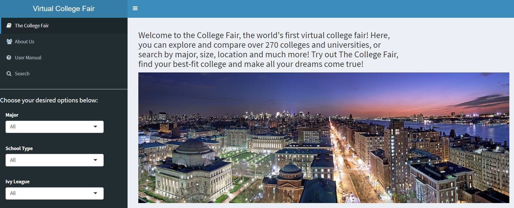

# Project 2: Shiny App Development Version 2.0

### [Project Description](doc/project2_desc.md) This is the instruction of this project. We conduct the project according to the guidelines from this file. 


- Term: Fall 2018
- Team: Group #8

## Project Title: Virtual College Fair
Term: Fall 2018

+ Team: Group #8
+ **Projec title**: + Team members (Alphabetical ordering of family name)
	+ team member 1: Lakehal, Yadir yl3435@columbia.edu
	+ team member 2: Li, Peilin pl2672@columbia.edu (Designated Presenter)
	+ team member 3: Rong, Chuqiao cr2945@columbia.edu
	+ team member 4: Sun, Qiaqia qs2184@columbia.edu
	+ team member 5: Xie, Yiding yx2443@columbia.edu
	+ team member 6: Yin, Yiqiao yy2502@columbia.edu
	

### Shiny App Link: https://y-yin.shinyapps.io/Virtual-College-Fair/

+ **Background**: 

More and more international students are choosing to study in America today. It is reported that more than 2,000,000 international students studied at U.S. colleges and universities in 2016 to 2018. However, the college search process is often a huge challenge with all the information available everywhere in today's digital age. It is hard to sieve through all the information overload, to collect various statistics, and to collate and compare them with ease. Exact details are hard to come by easily and there is often too much inertia to sieve through thousands and thousands of datasets. In order to help students out with these issues, our team have developed an application called the Uni-Mate. This applications hopes to enable international students to discover and compare schools in an more efficient manner. It provides the user with a simplified platform to filter and rank universities based on their own preferences, and output an interactive map & various density plots that would allow them to view and compare selected statistics of the various universities.

In a nutshell, our overall philosophy behind the creation of this application is to provide an alternative, more lighthearted and personalized platform to simplify the college decision making process for college applicants, and make it easier to obtain information amongst the sea of madness. In details, we want to emphasize the potential reasonale behind the competitive environment of getting admitted by Ivy League universities.

+ **Project summary**: 

This project explores and visualizes 272 universities in America by using the data on ([College Scorecard Database](https://collegescorecard.ed.gov/data/documentation/)), ([2016 Forbes Ranking](data/ranking_forbes_2016.csv)), ([HappyScore Data](data/Happinessdata.csv)) and ([Crime Data](data/CrimeData_final.csv)). We created a Shiny App to help users discover and compare universities. 



+ **Filter & Rank**: easily discover and compare the universities that meet user's requirements

Two filter parts. One part is the basic filter: the user can choose universities based on "Major", "Type of School", "SAT Score", "Ivy League Universities", "East or West Coast", and "Type of City". The other part is the advanced filter: they can give their weights to "Academic Performance", "Average Cost", "Earning & Jobs", "Social Security" and "Life Quality", based on how important they think these factors matter to them. 

Two ranking options. One option is based on the Forbes University Rankings. The other one is using the weights the user gave to calculate the rank of these universities - ultimately producing a personalized ranking. 

+ **Map & Plot**: visualization of relevant features of the universities 

Map: Every university that meet the user's requirments will show on the map. After clicking on the university, both the URL and Forbes rank of the school will be in view. The map also adds circular illustration of ranking according to Forbes Ranking System. The color of the circles indicate the City Type and the radius of the circles indicate the ranking of the college/university (the larger the circle the higher the ranking). 

Plots: There will be multiple interacitve density plots based on the filtered data. These will show Admission Rate, SAT Score, Average Cost, Earnings, Crime Rate, Happy Score, and Happy Rank of the selected (filtered) universities.


+ **Contribution statement**: (Please also see [Contribution Statement](doc/contribution_statement.md)) 

All team members contributed equally in all stages of this project. All team members approve our work presented in this GitHub repository including this contributions statement. 

We also want to thank Professor Ying Liu and Professor Tian Zheng for hosting lectures of Advanced Data Science this semester. It is with transcending gratitude that we announce here what an inspiration both professors have been throughout our experience of building this shiny app. Their knowledge, understanding and genuine “care” for others is illuminated in everything they do! We, Group 8, are in forever debt for their teachings. Moreoever, we also want to thank TA, Chengliang Tang. There is not enough we can say about how much we thank heaven that he is our teaching assistance. His patience and understanding are unsurpassed. We are grateful for being his students.


```
proj/
├── app/
├── lib/
├── data/
├── doc/
└── output/
```

Please see each subfolder for a README file.

